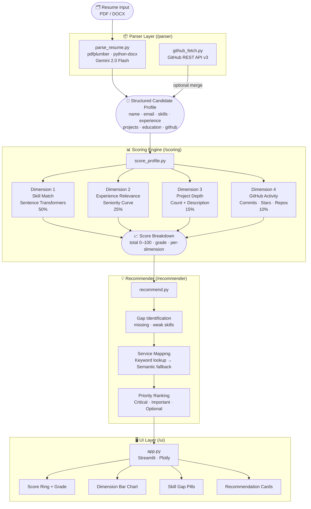

# SMARRTIF AI — CV Analyser: Technical Architecture

> **Version:** 1.0.0 · **Last Updated:** 2026-08-03 · **Status:** Prototype

---

## Table of Contents

1. [System Architecture](#1-system-architecture)
2. [Tech Stack & Justifications](#2-tech-stack--justifications)
3. [Scoring Methodology](#3-scoring-methodology)
4. [API Integration Status](#4-api-integration-status)
5. [Bias Mitigation](#5-bias-mitigation)

---

## 1. System Architecture

### 1.1 High-Level Pipeline



### 1.2 Data Flow Detail

```
┌──────────────────────────────────────────────────────────────────────┐
│  INPUT LAYER                                                         │
│  User uploads PDF or DOCX  →  Streamlit writes to temp file         │
│  User enters GitHub username (optional)                              │
│  User selects target role from /data/roles.json                      │
└───────────────────────────┬──────────────────────────────────────────┘
                            │
                            ▼
┌──────────────────────────────────────────────────────────────────────┐
│  PARSE LAYER                                                         │
│  1. Text extraction  : pdfplumber (PDF) / python-docx (DOCX)        │
│  2. Structuring      : Gemini 2.0 Flash with JSON MIME type enforced │
│  3. Key normalisation: strips newlines/quotes from Gemini JSON keys  │
│  4. GitHub merge     : fetch_github_profile() + merge_github_into_   │
│                        profile() appends languages, commits, repos   │
└───────────────────────────┬──────────────────────────────────────────┘
                            │
                            ▼
┌──────────────────────────────────────────────────────────────────────┐
│  SCORE LAYER                                                         │
│  Loads roles.json → gets required skills with weights (1–3)         │
│  Embeds candidate skills + required skills via all-MiniLM-L6-v2     │
│  Computes cosine similarity matrix (n_required × n_candidate)        │
│  Aggregates 4 weighted dimension scores → 0–100 total               │
└───────────────────────────┬──────────────────────────────────────────┘
                            │
                            ▼
┌──────────────────────────────────────────────────────────────────────┐
│  RECOMMEND LAYER                                                     │
│  Reads per_skill_detail from scoring breakdown                       │
│  Classifies gaps: missing (sim < 0.40) / weak (0.40–0.65)          │
│  Maps each gap to a SMARRTIF service via keyword → semantic lookup   │
│  Returns priority-ranked list: Critical → Important → Optional       │
└───────────────────────────┬──────────────────────────────────────────┘
                            │
                            ▼
┌──────────────────────────────────────────────────────────────────────┐
│  UI LAYER                                                            │
│  Streamlit renders: Score ring · Plotly bar + radar charts          │
│  Skill gap pills (green/yellow/red) · Recommendation cards          │
│  Full parsed JSON expander · GitHub stats expander                  │
└──────────────────────────────────────────────────────────────────────┘
```

---

## 2. Tech Stack & Justifications

### Core Language

| Tool | Version | Justification |
|---|---|---|
| **Python 3.12** | 3.12+ | Mature ecosystem for ML, NLP, and data tooling with native `type | None` syntax. |

### Resume Parsing

| Tool | Justification |
|---|---|
| **pdfplumber** | Extracts text and positional data from PDFs with reliable table support, outperforming PyPDF2 on complex resume layouts. |
| **python-docx** | Official OOXML parser for DOCX files; also pulls text from table cells common in resume templates. |
| **google-generativeai (Gemini 2.0 Flash)** | Converts raw unstructured resume text into a strict JSON schema in one API call, eliminating brittle regex-based parsers. |

### Embeddings & Similarity

| Tool | Justification |
|---|---|
| **sentence-transformers** | Provides `all-MiniLM-L6-v2`, a lightweight (~90 MB) but highly accurate semantic embedding model with no GPU requirement. |
| **scikit-learn** | `cosine_similarity()` from sklearn handles the vectorised similarity matrix computation efficiently. |
| **numpy** | Underpins all embedding vector operations and argmax lookups. |

### API Integrations

| Tool | Justification |
|---|---|
| **requests** | Handles all GitHub REST API calls with session reuse for connection pooling. |

### UI & Visualisation

| Tool | Justification |
|---|---|
| **Streamlit** | Enables rapid prototyping of interactive ML UIs in pure Python without JavaScript. |
| **Plotly** | Produces interactive, dark-themed bar and radar charts that integrate natively with Streamlit's `st.plotly_chart`. |

### Infrastructure & Config

| Tool | Justification |
|---|---|
| **python-dotenv** | Loads `GEMINI_API_KEY` and `GITHUB_TOKEN` from `.env` without leaking secrets into version control. |
| **uv** | Ultra-fast Rust-based package installer that resolves and installs all dependencies significantly faster than `pip`. |
| **Git** | Standard version control; `.gitignore` excludes `.env`, `.venv`, `__pycache__`, and uploaded CV files. |

---

## 3. Scoring Methodology

The scoring engine produces a single **0–100 score** composed of four independently calculated dimensions, each weighted by its predictive relevance to job performance.

### 3.1 Dimension Overview

```
Total Score = (Skill Match × 0.50)
            + (Experience Relevance × 0.25)
            + (Project Depth × 0.15)
            + (GitHub Activity × 0.10)
```

### 3.2 Dimension 1 — Skill Match (50%)

**Why 50%?** Skills are the most direct and objective signal of role readiness.

**How it works:**

1. Every skill listed on the candidate's resume is converted into a 384-dimensional numerical vector using the `all-MiniLM-L6-v2` sentence transformer model.
2. Every required skill for the target role (from `roles.json`) is embedded the same way.
3. A cosine similarity matrix is computed between all required skills and all candidate skills.
4. For each required skill, the **highest similarity** across all candidate skills is taken — this is the "best match".
5. Each similarity score is multiplied by the role's **importance weight** (1 = nice-to-have, 2 = important, 3 = critical).
6. The final score is the weighted sum divided by the maximum possible weighted sum, scaled to 0–100.

**Why cosine similarity instead of exact keyword matching?**
Exact matching would fail for semantically equivalent terms — e.g. a candidate who lists "PyTorch" would score 0 on a role that requires "Deep Learning Frameworks". Cosine similarity captures that `PyTorch ≈ Deep Learning Framework` with a similarity of ~0.72.

**Thresholds:**

| Similarity Range | Classification |
|---|---|
| >= 0.65 | Covered |
| 0.40 – 0.65 | Weak (partial match) |
| < 0.40 | Missing |

### 3.3 Dimension 2 — Experience Relevance (25%)

**Why 25%?** Years of experience is a strong proxy for depth of practical knowledge, but less important than demonstrable skills.

**How it works:**

The total years of professional experience are parsed from the experience list using regex patterns that handle common formats:

| Format | Example | Parsed |
|---|---|---|
| Year range | `2020-2023` | 3.0 years |
| Present tense | `2019-Present` | current year minus 2019 |
| Plain text | `3 years` | 3.0 years |
| Bare year | `2021` | 0.0 years (assumed start) |

Total years are then mapped onto a **seniority curve** via linear interpolation:

```
0–1 yr   →  0–30 pts   (entry level)
1–3 yrs  →  30–55 pts  (junior)
3–5 yrs  →  55–75 pts  (mid-level)
5–8 yrs  →  75–90 pts  (senior)
8+ yrs   →  90–100 pts (principal / staff)
```

### 3.4 Dimension 3 — Project Depth (15%)

**Why 15%?** Projects are evidence of applied skills but are harder to verify and vary in complexity.

**How it works:**

```
count_score    = min(project_count / 6, 1.0) × 70
richness_bonus = min(avg_description_length / 200, 1.0) × 30
total          = count_score + richness_bonus  (capped at 100)
```

- Both resume projects and GitHub projects (if available) are counted.
- `richness_bonus` rewards candidates who describe *what* their project does and *how* — a proxy for technical depth and communication ability.
- Saturation at 6 projects and 200-character descriptions prevents gaming.

### 3.5 Dimension 4 — GitHub Activity (10%)

**Why 10%?** GitHub activity is strong evidence for software-oriented roles but is irrelevant or unavailable for many candidates.

**How it works (when GitHub data is present):**

```
commit_score = min(commits_last_year / 500, 1.0) × 50
star_score   = min(total_stars / 200, 1.0)       × 30
repo_score   = min(public_repos / 20, 1.0)        × 20
```

- **Commits/year** via the GitHub Search Commits API (last 365 days) — measures consistency of contribution.
- **Stars** — a crowd-sourced quality signal from the developer community.
- **Public repos** — breadth of independent work.

When GitHub data is absent, this dimension scores **0** rather than being excluded, which reflects the reality that candidates without a public portfolio are at a disadvantage for engineering roles.

### 3.6 Grade Scale

| Score | Grade | Label |
|---|---|---|
| 93–100 | A+ | Exceptional match |
| 87–92 | A | Excellent match |
| 80–86 | B+ | Strong candidate |
| 73–79 | B | Good candidate |
| 65–72 | C+ | Moderate match |
| 58–64 | C | Developing candidate |
| 50–57 | D+ | Significant gaps |
| 0–49 | D | Not recommended |

---

## 4. API Integration Status

### 4.1 GitHub REST API — Implemented

**Auth flow:**
```
User provides GitHub Personal Access Token (PAT)
  → Stored in .env as GITHUB_TOKEN
  → Loaded via python-dotenv into os.environ
  → Passed as Authorization: Bearer {token} header on every request
```

**Endpoints used:**

| Endpoint | Data Collected |
|---|---|
| `GET /users/{username}` | Name, bio, location, company, followers |
| `GET /users/{username}/repos` | Language per repo, stars, forks, topics, URLs |
| `GET /search/commits?q=author:{username}` | Total commit count in last 365 days |
| `GET /users/{username}/events/public` | Fallback commit count via PushEvents (~90 days) |

**Rate limits:**
- Unauthenticated: 60 requests/hour (commit search unavailable)
- Authenticated (PAT): 5,000 requests/hour + 30 search requests/minute

**Fallback strategy:** If the Search Commits API is unavailable (no token or rate limited), the system falls back to the Events API which covers approximately 90 days and a maximum of 300 events.

---

### 4.2 LinkedIn API — Proposed (Not Implemented)

**Why it would add value:**
LinkedIn holds verified professional experience, endorsements, connection count, and course completions — all high-signal data points for career scoring.

**Proposed auth flow:**
```
OAuth 2.0 Authorization Code Flow
  1. Redirect user to LinkedIn auth URL with scope: r_liteprofile, r_emailaddress
  2. User grants consent → LinkedIn issues authorization code
  3. Backend exchanges code for access_token (POST /oauth/v2/accessToken)
  4. API calls with Authorization: Bearer {access_token}
  5. Token expiry: 60 days (requires refresh_token flow)
```

**Data points planned:**
- Work experience with company names, titles, and verified dates
- Skills endorsed by connections (weighted by endorsement count)
- Education institutions and degrees
- Certifications and LinkedIn Learning completions
- Profile completeness score

**Why not implemented in this prototype:**
1. **LinkedIn's API is gated** — the `r_liteprofile` and `r_fullprofile` scopes require a verified Partner Application approved by LinkedIn, which is not available to open-source prototypes.
2. **Slow approval process** — production LinkedIn API access can take weeks to months.
3. **Resume parsing covers the same data** — for a prototype, Gemini extracts experience and education from a PDF/DOCX just as accurately as LinkedIn's API would.

---

### 4.3 Tableau API — Proposed (Not Implemented)

**Why it would add value:**
Tableau Public hosts published workbooks that prove a candidate's real data visualisation skill — verifiable artefacts rather than self-reported claims.

**Proposed auth flow:**
```
Tableau Server REST API (Personal Access Token or Basic Auth)
  1. POST /api/{version}/auth/signin with credentials
  2. Receive token in response → include as X-Tableau-Auth header
  3. GET /api/{version}/sites/{siteId}/users/{userId}/workbooks
```

**Data points planned:**
- Number of published workbooks
- View counts (as a proxy for quality/reach)
- Workbook names and descriptions (to embed and compare against role requirements)

**Why not implemented:**
1. **Tableau Public has no official data API** — published workbook metadata is not exposed via a stable public REST endpoint.
2. **Tableau Server API requires an enterprise Tableau installation** — not accessible for public candidate profiles.
3. **Scraping is unreliable and violates ToS** — programmatic scraping of Tableau Public profiles is prohibited.

---

### 4.4 Power BI API — Proposed (Not Implemented)

**Why it would add value:**
Power BI workspace metrics and published report activity would validate BI Developer candidates' hands-on experience with Microsoft's BI stack.

**Proposed auth flow:**
```
Microsoft Identity Platform (OAuth 2.0)
  1. Register app in Azure Active Directory
  2. Request scopes: Dataset.Read.All, Report.Read.All
  3. Redirect to Microsoft login → authorization code returned
  4. Exchange for access_token via POST to:
     https://login.microsoftonline.com/{tenant}/oauth2/v2.0/token
  5. Call Power BI REST API with Authorization: Bearer {token}
```

**Data points planned:**
- Number of published reports and dashboards
- Dataset types used (DirectQuery, Import, Streaming)
- Workspace activity and collaboration count
- Last published date (recency signal)

**Why not implemented:**
1. **Requires Azure AD tenant registration** — candidates would need to authorise an enterprise Azure app, creating significant friction for a prototype.
2. **Power BI REST API is scoped to organisational workspaces** — public sharing requires a Premium capacity licence.
3. **Candidate data is typically private** — unlike GitHub public repos, Power BI reports default to organisational access only.

---

## 5. Bias Mitigation

### 5.1 Design Principles

The SMARRTIF AI CV Analyser is designed so that **scores are derived exclusively from evidence of skills and demonstrated work** — never from demographic signals, institutional prestige, or proxies that correlate with protected characteristics.

### 5.2 What the Scorer Measures (and Why It Is Fair)

| Dimension | What Is Measured | Evidence Basis |
|---|---|---|
| Skill Match | Semantic similarity between listed skills and role requirements | Candidate-declared skills matched against an objective role definition |
| Experience Relevance | Total *years* of professional experience | Duration only — not company name, company size, or industry prestige |
| Project Depth | Count of projects + average description length | Volume and articulacy of documented work — no quality judgement by topic |
| GitHub Activity | Commits, stars, repos | Observable, quantified, public activity — not repository topic or language |

### 5.3 What the Scorer Deliberately Does Not Measure

| Signal | Why It Is Excluded |
|---|---|
| **University name / ranking** | Institutional prestige correlates with socioeconomic background, not job performance. Only degree type is used in profile extraction; the institution is never fed into the score. |
| **Employer name / prestige** | Working at a large company does not inherently indicate higher skill than a startup. Only duration is used. |
| **Name, gender, age, nationality** | These fields are extracted by Gemini for display purposes only and are never passed to `score_profile()`. |
| **Photo or profile picture** | Not collected or processed at any point in the pipeline. |
| **GPA or academic grades** | Not extracted or scored — grades correlate weakly with professional performance and strongly with access to elite institutions. |
| **Number of endorsements** | Endorsements on LinkedIn reflect social networks, not capability. |
| **Gap years or career breaks** | The seniority curve uses total years, not continuous employment — career breaks are not penalised. |

### 5.4 Architectural Safeguards

```python
# score_profile() only receives these fields:
candidate = {
    "skills":     [...],     # flat list of strings
    "experience": [...],     # role, company (display only), years
    "projects":   [...],     # title, description
    "github":     {...},     # commits, stars, repos (numbers only)
}

# Name, email, phone, education institution are NEVER passed to the scorer
```

The `parse_resume()` function extracts name and contact fields for the UI display layer only. They are never passed to `score_profile()` or `generate_recommendations()` as scoring inputs.

### 5.5 Known Limitations and Future Work

| Limitation | Mitigation Plan |
|---|---|
| Self-reported skills may be inflated | Future: add a skills verification quiz or coding challenge integration |
| GitHub activity favours software engineers over PMs and analysts | GitHub dimension weighted at only 10%; scores 0 gracefully when absent |
| Semantic similarity model may encode societal biases from training data | Future: evaluate `all-MiniLM-L6-v2` for bias against domain-specific terminology from underrepresented communities |
| Resume text extraction quality varies by template complexity | Future: fallback to OCR (Tesseract) for image-based or heavily formatted PDFs |
| English-only resume parsing | Future: Gemini's multilingual capability can be leveraged with language-detection pre-processing |

---

*This document is maintained alongside the source code. For implementation details, see the inline docstrings in each module.*
